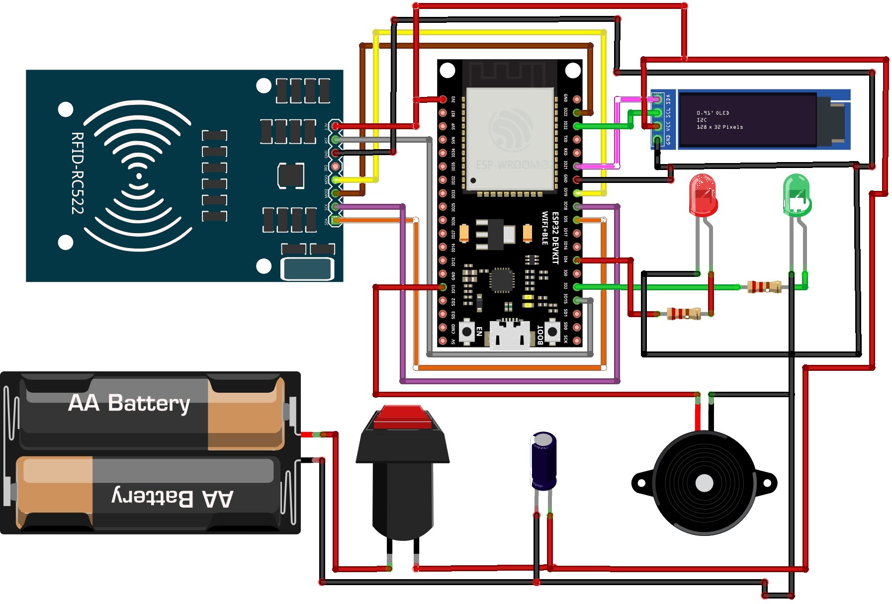

# RfidController
## Firmware del Sistema de Asistencia RFID con ESP32

Este repositorio aloja el código fuente para un sistema de control de asistencia y acceso basado en IoT utilizando el microcontrolador ESP32. El sistema está diseñado para identificar usuarios mediante etiquetas RFID (protocolo MIFARE), validar credenciales contra una API RESTful remota y proporcionar retroalimentación visual y auditiva inmediata a través de una pantalla OLED, indicadores LED y un zumbador piezoeléctrico.

La arquitectura sigue un modelo Cliente-Servidor donde el ESP32 actúa como un cliente ligero gestionando los periféricos de hardware y la comunicación de red, mientras que la lógica de negocio y la persistencia de datos son administradas por un backend centralizado.

## Arquitectura de Hardware

* Microcontrolador: ESP32 DevKit V1

* Módulo RFID: RC522 (Interfaz SPI)

* Pantalla: OLED 0.91" (Controlador SSD1306, Interfaz I2C)

### Indicadores:

* LED Verde (Acceso Permitido/Conexión Exitosa) 

* LED Rojo (Acceso Denegado/Error)

* Audio: Zumbador (Buzzer) Activo

### Estabilización de Energía: 

* Condensador electrolítico de 100µF (crítico para la estabilidad del RC522)

## Diagrama del Circuito

Esquema de conexión para el circuito.

<p align="center">
  
</p>

## Tabla de Conexiones

```Plaintext
+------------------+---------------------------+------------------------+
|    COMPONENTE    |      PIN COMPONENTE       |     PIN ESP32 (GPIO)   |
+------------------+---------------------------+------------------------+
|    RFID RC522    | SDA (SS)                  | GPIO 5                 |
|                  | SCK                       | GPIO 18                |
|                  | MOSI                      | GPIO 23                |
|                  | MISO                      | GPIO 19                |
|                  | RST                       | GPIO 15                |
+------------------+---------------------------+------------------------+
|     OLED I2C     | SDA                       | GPIO 21                |
|                  | SCL                       | GPIO 22                |
+------------------+---------------------------+------------------------+
|   PERIFERICOS    | LED Verde                 | GPIO 2  (Res 220 ohm)  |
|                  | LED Rojo                  | GPIO 4  (Res 220 ohm)  |
|                  | Buzzer                    | GPIO 13                |
+------------------+---------------------------+------------------------+
```

### Importante

Los LEDs requieren resistencias en serie de 220Ω para limitar la corriente. El módulo RC522 debe ser alimentado estrictamente con 3.3V; el uso de 5V puede dañar la lógica del módulo.

